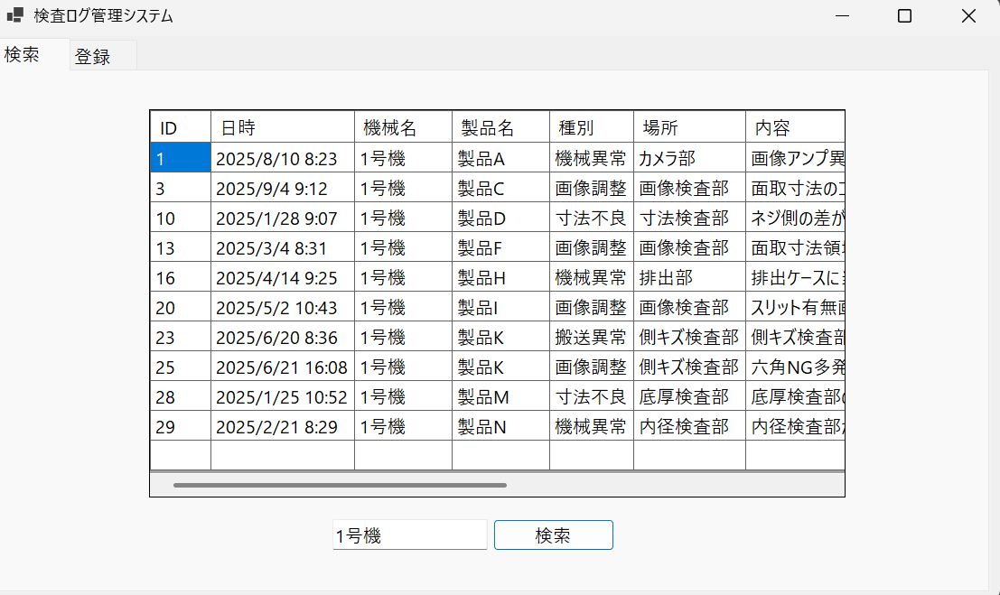
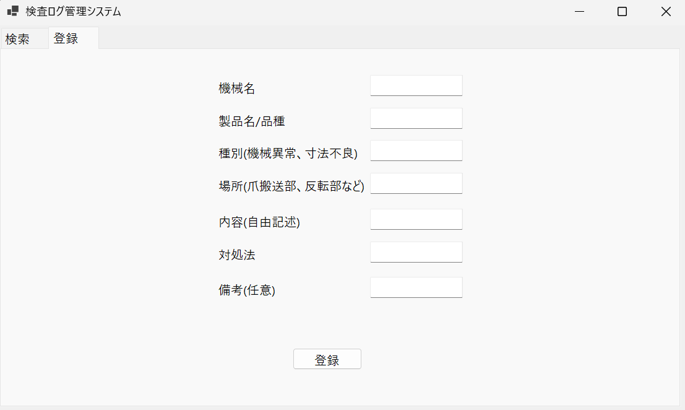
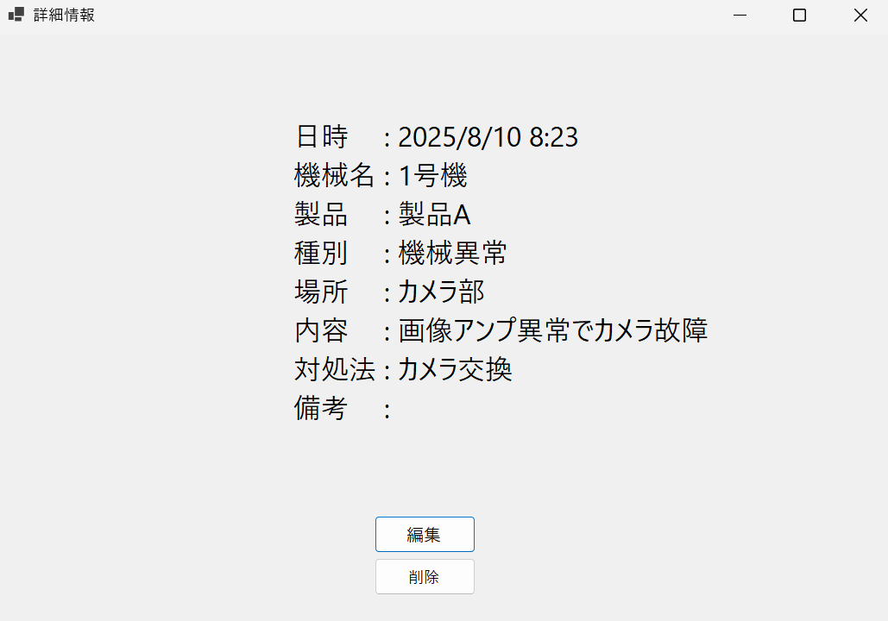
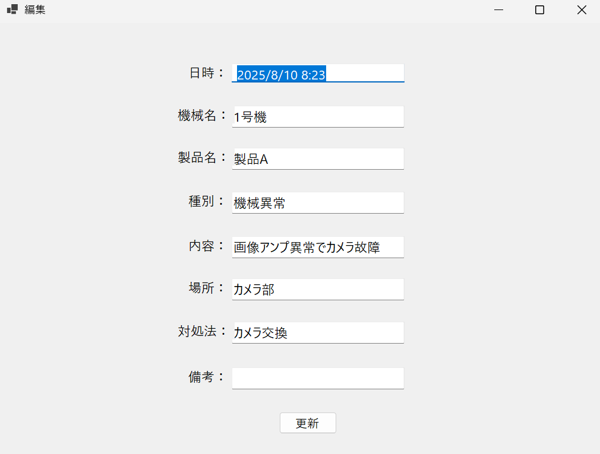

# inspection_log_viewer

C言語で作成したCSV版のエラーログツール(error_log.c)をもとに作成した、検査エラーの記録・検索アプリです。
製造現場で起きた機械エラーや調整の記録を、SQLiteデータベースに登録し、検索・編集・削除できます。

## 画面

### 検索画面(MainForm)

全項目(ID・日時・機械名・製品名・種別・場所・内容・対処法・備考)を対象にキーワード検索できます。
結果は一覧表示され、行をクリックすると詳細画面が開きます。

### 登録画面(MainForm)

機械名・製品名・種別・場所・内容・対処法・備考を入力して登録します。
登録後は一覧に自動で反映されます。

### 詳細画面(DetailForm)

選択したエラーの全項目を表示します。ここから編集画面への移動と、削除ができます。

### 編集画面(EditForm)

各項目を書き換えて更新します。更新内容はSQLiteに保存され、一覧にも反映されます。

## 使用技術
- C# / .NET
- Windows Forms (WinForms)
- SQLite (Microsoft.Data.Sqlite)

## データベース
`inspection_system.db` に動作確認用のサンプルデータが入っています。

| テーブル | 内容 | このアプリでの使用 |
|---|---|---|
| error_log | 機械エラー・調整の記録 | 使用(検索・登録・編集・削除) |
| inspection_log | 検査1回ごとの結果(判定・寸法・画像パス) | 未使用(検査アプリで使用予定) |
| adjustment_history | 画像調整のパラメータと結果 | 未使用(画像調整ツールで使用予定) |

## 動かし方
1. Visual Studio 2022以降をインストールする
2. 本リポジトリをクローン、またはZIPでダウンロードする
3. `inspection_log_viewer.csproj` をVisual Studioで開く
4. ビルド・実行する

## 今後の想定
- 検査アプリ(inspection_manager)と同じDBを介して連携する
- 別PCでの運用を想定する場合は、SQLiteからサーバー型DBへの移行を検討する
